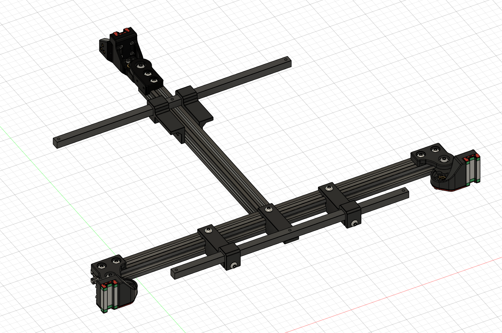

Bed mounting was one of the more challenging parts of this conversion .. 

And a big reason why I gave up on the V1 conversion .. 

The "proper" voron bed setup is one of the most expensive parts of the printer, so I really wanted to be able to to avoid having to make that a requirement.

I ended up re-using some of the hardware that came with the bed .. those 10x10 square rods work really well to mount the very specific 6 screw mount .. 

Those 10x10 rods had to be cut down to size,

This is what this all looks like assembled:

The pieces which fit around the 10x10 use a M5 25mm bolt, with a hex nut to secure it to the 10x10 rods.
With standard M5x10 bolts going into T-nuts or insert nuts to attach them to the extrusions.

I did away with the adjustment "wheels" and just used M3 nylock nuts to secure the bed screws.

I also swapped out the springs for these silicons spacers: https://www.aliexpress.com/item/1005003344878167.html
(it feels like it helped make things smoother)

Securing the back center bed screw is a bit finicky since it aligns with the 2020 extrusion.